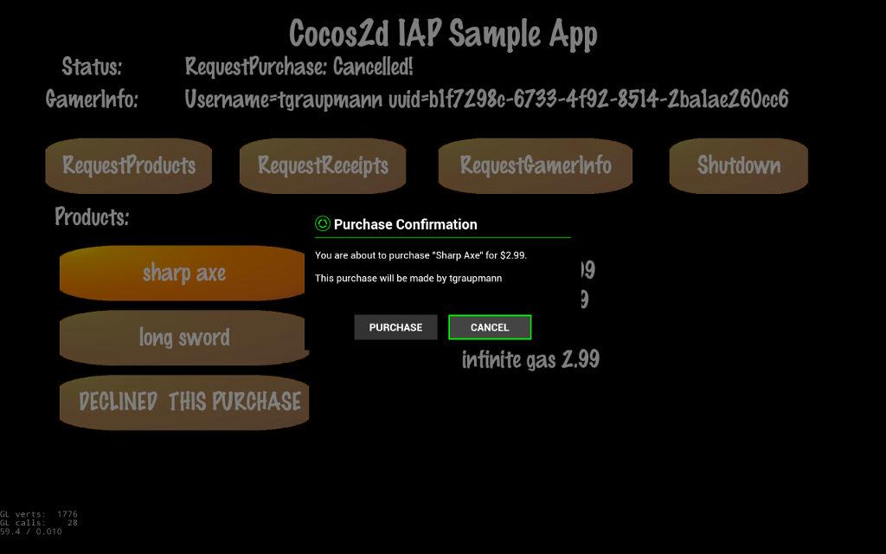

# Cocos2d Game Engine

The [RazerSDK](https://github.com/razerofficial/razer-sdk-docs) can be accessed via the `RazerSDK Cocos2d Plugin`.

## Forums #

* [Forge TV on Razer Forums](https://insider.razerzone.com/index.php?forums/razer-forge-tv.126/)

* [Cocos2d Forums](http://discuss.cocos2d-x.org/)

## Resources

* Download the [Cocos2d Engine](http://www.cocos2d-x.org/)

* Download [Python 2.7](https://www.python.org/)

* Download [NVIDIA Codeworks for Android](https://developer.nvidia.com/AndroidWorks)

* Download [proj.visualstudio.zip](https://aka.ms/vscocosandroidsample) from the [Cocos2d-x Visual Studio Android Project](https://blogs.msdn.microsoft.com/vcblog/2016/07/12/cocos2d-x-visual-studio-android-project/) blog post

## Quick Start

* Download the `Cocos2d Engine` and unpack `cocos2d-x-3.12`

* Install `Python 2.7` and add `Python` to your path

* Install `NVIDIA Codeworks for Android`

* Run the following command from the unpacked `cocos2d-x-3.12` folder:

```
python setup.py
```

* When prompted, enter any missing paths (similar to the following):

```
->Please enter the path of ANDROID_SDK_ROOT (or press Enter to skip):C:\NVPACK\android-sdk-windows\
 
->Please enter the path of ANT_ROOT (or press Enter to skip):C:\NVPACK\apache-ant-1.8.2\bin
``` 

* After the setup is complete, close and reopen the terminal

* `Cocos2d` projects are generated on the command-line from the `cocos2d-x-3.12` folder.

```
cocos new -l cpp -p com.your.package.name -d Path\To\Generate\Project ProjectName
```

* Generated `Cocos2d` projects are 400MB+ in size.

* Unpack `proj.visualstudio.zip` in the generated project folder

* Open the project's `proj.visualstudio\Cocos2d.sln` in `Visual Studio 2015`

* Right-click the `Cocos2dcpp` project in the `Solution Explorer` and click `Properties`

* Navigate to `Configuration Properties->C/C++->General->Additional Include Directories` and add the path:

```
$(VS_NdkRoot)\sources\android\native_app_glue
```

* Click `OK`

* Customize the `proj.visualstudio\Cocos2d\AndroidManifest.xml` to match the `package-name` from the [developer portal](https://devs.ouya.tv) game entry

* Copy `store-sdk-standard-release.jar` and `pluginrazersdk-release.jar` to the `proj.visualstudio\Cocos2d\libs` folder. `Cocos2d` appears to not support the `AAR` format yet...

* In the `Solution Explorer` add existing libraries `store-sdk-standard-release.jar` and `pluginrazersdk-release.jar` to the `Cocos2d->libs` project.

* Copy the repository's `RazerSDK` folder to the `proj.visualstudio\Cocos2dcpp\jni` project folder.

* In the `Solution Explorer` add a `RazerSDK` filter to the `Cocos2dcpp->jni` project.

* Add the existing `RazerSDK` source to the `RazerSDK` filter.

## Examples 

* Since `Cocos2d` projects are so large in size, use the terminal to generate the `Cocos2d` project and then copy the modified example files over the generated project.

### In-App-Purchase Example

The [InAppPurchases](https://github.com/razerofficial/cocos2d-plugin-razer-sdk/tree/master/InAppPurchases) sample is a `Cocos2d` Visual Studio project. The sample source modifies the default `Cocos2d` generated source and includes the `RazerSDK` plugin.



* Generate the `Cocos2d` project with the following command (similar to the following):

```
cocos new -l cpp -p com.razerzone.store.sdk.engine.cocos2d.examples.inapppurchases -d C:\Cocos2d InAppPurchases
```

* Unpack `proj.visualstudio.zip` in the generated `InAppPurchases` folder

* Copy this repository's `InAppPurchases` folder over the generated `InAppPurchases` folder

* Open `InAppPurchases\proj.visualstudio\Cocos2d.sln` in `Visual Studio 2015`

* In Visual Studio, Run with the `Debug->Run Without Debugging` menu item
