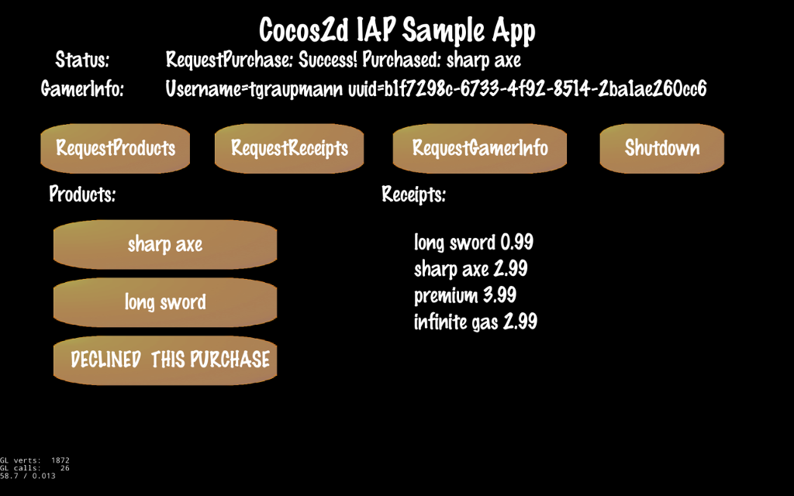

# Cocos2d Game Engine

The [RazerSDK](https://github.com/razerofficial/razer-sdk-docs) can be accessed via the `RazerSDK Cocos2d Plugin`.

## Forums #

* [Forge TV on Razer Forums](https://insider.razerzone.com/index.php?forums/razer-forge-tv.126/)

* [Cocos2d Forums](http://discuss.cocos2d-x.org/)

## Resources

* Download the [Cocos2d Engine](http://www.cocos2d-x.org/)

* Download [Python 2.7](https://www.python.org/)

* Download [NVIDIA Codeworks for Android](https://developer.nvidia.com/AndroidWorks)

* Download [proj.visualstudio.zip](https://aka.ms/vscocosandroidsample) from the [Cocos2d-x Visual Studio Android Project](https://blogs.msdn.microsoft.com/vcblog/2016/07/12/cocos2d-x-visual-studio-android-project/) blog post

* [SpriteBuilder for Android](http://android.spritebuilder.com/) exposes the `Android SDK` to `Objective-C`

## Quick Start

* Download the `Cocos2d Engine` and unpack `cocos2d-x-3.12`

* Install `Python 2.7` and add `Python` to your path

* Install `NVIDIA Codeworks for Android`

* Run the following command from the unpacked `cocos2d-x-3.12` folder:

```
python setup.py
```

* When prompted, enter any missing paths (similar to the following):

```
->Please enter the path of ANDROID_SDK_ROOT (or press Enter to skip):C:\NVPACK\android-sdk-windows\
 
->Please enter the path of ANT_ROOT (or press Enter to skip):C:\NVPACK\apache-ant-1.8.2\bin
``` 

* After the setup is complete, close and reopen the terminal

* `Cocos2d` projects are generated on the command-line from the `cocos2d-x-3.12` folder.

```
cocos new -l cpp -p com.your.package.name -d Path\To\Generate\Project ProjectName
```

* Generated `Cocos2d` projects are 400MB+ in size.

* Unpack `proj.visualstudio.zip` in the generated project folder

* Open the project's `proj.visualstudio\Cocos2d.sln` in `Visual Studio 2015`

* Right-click the `Cocos2dcpp` project in the `Solution Explorer` and click `Properties`

* Navigate to `Configuration Properties->C/C++->General->Additional Include Directories` and add the path:

```
$(VS_NdkRoot)\sources\android\native_app_glue
```

* Click `OK`

* Customize the [proj.visualstudio\Cocos2d\AndroidManifest.xml](https://github.com/razerofficial/cocos2d-plugin-razer-sdk/blob/master/InAppPurchases/proj.visualstudio/Cocos2d/AndroidManifest.xml) to match the `package-name` from the [developer portal](https://devs.ouya.tv) game entry

* Copy `store-sdk-standard-release.jar` and `pluginrazersdk-release.jar` to the `proj.visualstudio\Cocos2d\libs` folder. `Cocos2d` appears to not support the `AAR` format yet...

* In the `Solution Explorer` add existing libraries `store-sdk-standard-release.jar` and `pluginrazersdk-release.jar` to the `Cocos2d->libs` project.

* Copy the repository's `RazerSDK` folder to the `proj.visualstudio\Cocos2dcpp\jni` project folder.

* In the `Solution Explorer` add a `RazerSDK` filter to the `Cocos2dcpp->jni` project.

* Add the existing `RazerSDK` source to the `RazerSDK` filter.

* Customize the [proj.visualstudio/Cocos2d/src/org/cocos2dx/cpp/AppActivity.java](https://github.com/razerofficial/cocos2d-plugin-razer-sdk/blob/master/InAppPurchases/proj.visualstudio/Cocos2d/src/org/cocos2dx/cpp/AppActivity.java) to set the `Activity` and to pass `onActivityResult` to the `RazerSDK` plugin.

```
package org.cocos2dx.cpp;

import android.content.Intent;
import android.os.Bundle;
import com.razerzone.store.sdk.engine.cocos2d.Plugin;
import org.cocos2dx.lib.Cocos2dxActivity;

public class AppActivity extends Cocos2dxActivity {
	@Override
	protected void onCreate(Bundle savedInstanceState) {
		Plugin.setActivity(this);
		super.onCreate(savedInstanceState);
	}

	@Override
    protected void onActivityResult(int requestCode, int resultCode, Intent data) {
		if (Plugin.processOnActivityResult(requestCode, resultCode, data)) {
			return;
		}
		super.onActivityResult (requestCode, resultCode, data);
	}
}
``` 

## Examples 

* Since `Cocos2d` projects are so large in size, use the terminal to generate the `Cocos2d` project and then copy the modified example files over the generated project.

### In-App-Purchase Example

The [InAppPurchases](https://github.com/razerofficial/cocos2d-plugin-razer-sdk/tree/master/InAppPurchases) sample is a `Cocos2d` Visual Studio project. The sample source modifies the default `Cocos2d` generated source and includes the `RazerSDK` plugin.



#### Visual Studio Setup

* Generate the `Cocos2d` project with the following command (similar to the following):

```
cocos new -l cpp -p com.razerzone.store.sdk.engine.cocos2d.examples.inapppurchases -d C:\Cocos2d InAppPurchases
```

* Unpack `proj.visualstudio.zip` in the generated `InAppPurchases` folder

* Copy this repository's [InAppPurchases](https://github.com/razerofficial/cocos2d-plugin-razer-sdk/tree/master/InAppPurchases) folder over the generated `InAppPurchases` folder

* Open `InAppPurchases\proj.visualstudio\Cocos2d.sln` in `Visual Studio 2015`

* In Visual Studio, Run with the `Debug->Run Without Debugging` menu item

#### Android Studio Setup

* Generate the `Cocos2d` project with the following command (similar to the following):

```
cocos new -l cpp -p com.razerzone.store.sdk.engine.cocos2d.examples.inapppurchases -d C:\Cocos2d InAppPurchases
```

* Copy this repository's [InAppPurchases](https://github.com/razerofficial/cocos2d-plugin-razer-sdk/tree/master/InAppPurchases) folder over the generated `InAppPurchases` folder

* Open [InAppPurchases\proj.android-studio](https://github.com/razerofficial/cocos2d-plugin-razer-sdk/tree/master/InAppPurchases/proj.android-studio) in `Android Studio`

* Navigate to the `InAppPurchases\proj.android-studio\app\jni` folder and run the following terminal command to build `NDK`:

```
ndk-build
```

* Wait for the `NDK` build to compile

* In `Android Studio`, run the app with the `Run->Run app` menu item

#### Main.cpp

The [InAppPurchases\proj.visualstudio\Cocos2dcpp\jni\main.cpp](https://github.com/razerofficial/cocos2d-plugin-razer-sdk/blob/master/InAppPurchases/proj.visualstudio/Cocos2dcpp/jni/main.cpp) has a special `JNI` hook to load the `RazerSDK` plugin.

```
// only runs on Android
#if ANDROID

// Get a reference to the Hello World Example scene which has buttons that call the plugin
#include "..\..\..\Classes\HelloWorldScene.h"

// Get a reference to the plugin so it can be initialized
#include "RazerSDK\RazerSDK_Plugin.h"

#endif
```

Use the main `JNI` hook to initialize the `Java` plugin at the right time. The sample has all the `RazerSDK API` calls in [InAppPurchases\Classes\HelloWorldScene.cpp](https://github.com/razerofficial/cocos2d-plugin-razer-sdk/blob/master/InAppPurchases/Classes/HelloWorldScene.cpp).

```
void cocos_android_app_init (JNIEnv* env) {
    LOGD("cocos_android_app_init");
    AppDelegate *pAppDelegate = new AppDelegate();

#if ANDROID
	LOGD("Cocos2D RazerSDK Plugin Loading...");
	RazerSDK::Plugin::InitJNI();
	HelloWorld::GetInstance()->InitPlugin();
#endif
}
```

[InAppPurchases\Classes\HelloWorldScene.h](https://github.com/razerofficial/cocos2d-plugin-razer-sdk/blob/master/InAppPurchases/Classes/HelloWorldScene.h) defines several `RazerSDK` callbacks to handle communication from the `RazerSDK` back to `Cocos2d`. The callbacks are static to avoid the pointers from going out of scope.

```
#if ANDROID
	static Main_CallbacksInitPlugin _sMain_CallbacksInitPlugin;
	static Main_CallbacksRequestGamerInfo _sMain_CallbacksRequestGamerInfo;
	static Main_CallbacksRequestProducts _sMain_CallbacksRequestProducts;
	static Main_CallbacksRequestPurchase _sMain_CallbacksRequestPurchase;
	static Main_CallbacksRequestReceipts _sMain_CallbacksRequestReceipts;
	static Main_CallbacksShutdown _sMain_CallbacksShutdown;
#endif
```

The sample extends several `RazerSDK` callbacks so that the main application code can display results in the UI. The sample application callbacks are prefixed with `Main`. [InAppPurchases/Classes/Main_CallbacksInitPlugin.h](https://github.com/razerofficial/cocos2d-plugin-razer-sdk/blob/master/InAppPurchases/Classes/Main_CallbacksInitPlugin.h) extends [InAppPurchases/proj.visualstudio/Cocos2dcpp/jni/RazerSDK/RazerSDK_CallbacksInitPlugin.h](https://github.com/razerofficial/cocos2d-plugin-razer-sdk/blob/master/InAppPurchases/proj.visualstudio/Cocos2dcpp/jni/RazerSDK/RazerSDK_CallbacksInitPlugin.h)

```
#if ANDROID
#include "RazerSDK\RazerSDK_CallbacksInitPlugin.h"

class Main_CallbacksInitPlugin : public CallbacksInitPlugin
{
public:
	void OnSuccess();
	void OnFailure(int errorCode, const std::string& errorMessage);
};

#endif
```

[InAppPurchases/Classes/HelloWorldScene.cpp](https://github.com/razerofficial/cocos2d-plugin-razer-sdk/blob/master/InAppPurchases/Classes/HelloWorldScene.cpp) uses `Cocos2d` button callbacks to invoke the `RazerSDK` API calls.

```
void HelloWorld::shutdownCallback(Ref* pSender)
{
	RazerSDK::Plugin::shutdown(&_sMain_CallbacksShutdown);
}
```

`RazerSDK` callbacks occur outside the main thread and the `cocos2d::Director` has to be used so that the callback can interact with the `Cocos2d` UI. [InAppPurchases/Classes/Main_CallbacksShutdown.cpp](https://github.com/razerofficial/cocos2d-plugin-razer-sdk/blob/master/InAppPurchases/Classes/Main_CallbacksShutdown.cpp)

```
void Main_CallbacksShutdown::OnSuccess()
{
	cocos2d::Director::getInstance()->getScheduler()->performFunctionInCocosThread([] {
		// execute code on main thread
		HelloWorld::GetInstance()->UpdateStatusText("Shutdown: Success!");
		HelloWorld::GetInstance()->Shutdown();
	});
}
```

## Razer SDK

The `RazerSDK` can be accessed using the `RazerSDK Cocos2d Plugin` which provides access to the `C++ API`.

### OnFailure

All `OnFailure` callbacks return an `int errorCode` and `std::string errorMessage` when used by `RazerSDK` function calls.

### OnCancel

All `OnCancel` callbacks have no parameters when used by `RazerSDK` function calls.

### InitPlugin

See the [RazerSDK Documentation](https://github.com/razerofficial/razer-sdk-docs) for details on how to obtain the `Secret API Key`.

The `RazerSDK::initPlugin` function takes a `std::string` parameter for the `SecretApiKey`. The second parameter takes a pointer to a `CallbacksInitPlugin` that can be extended. The `OnSuccess` callback is invoked if the `RazerSDK` is initialized successfully. The `OnFailure` callback is invoked if the `RazerSDK` fails to initialize.

```
	std::string secretApiKey = "eyJkZXZlbG9wZXJfaWQiOiIzMTBhOGY1MS00ZDZlLTRhZTUtYmRhMC1iOTM4";
	secretApiKey += "NzhlNWY1ZDAiLCJkZXZlbG9wZXJfcHVibGljX2tleSI6Ik1JR2ZNQTBHQ1Nx";
	secretApiKey += "R1NJYjNEUUVCQVFVQUE0R05BRENCaVFLQmdRQ3BkZUs4SDh6NG9qb0czZUI4";
	secretApiKey += "azU4SWpWaEpJUkQ5MSt0aGQ1NjJNaXlEa09teEhLSXFMUlFId25OZW4xRHkv";
	secretApiKey += "TGxnTStzak1GaEZHL0dERUVWemRIeTRNNkkyc1l6bGR4VmNLWWFpUlhFa0ls";
	secretApiKey += "NUNyWjhtRGdLaWgzOFNueDFPY3R3UzFQM0wxcXA3LzZiM2xlejY4ZmIyalVV";
	secretApiKey += "WFpIaStaRDZROGlPbzE5V3Rhd0lEQVFBQiJ9";

	RazerSDK::Plugin::initPlugin(secretApiKey, &_sMain_CallbacksInitPlugin);
```

### RequestGamerInfo

`RazerSDK::requestGamerInfo` returns the `GamerInfo` for the logged in user. This method should only be invoked after the `RazerSDK` has successfully initialized. The `RazerSDK::requestGamerInfo` function takes only a pointer to a `CallbacksRequestProducts` that can be extended. The `OnSuccess` callback is invoked if the operation completes successfully. The `OnFailure` callback is invoked if the operation failed. The `OnCancel` callback is invoked if the operation was canceled. The `OnSuccess` delegate receives a `RazerSDK::GamerInfo` object. The `RazerSDK::GamerInfo` object provides the `Username` and `Uuid` fields.

```
	RazerSDK::Plugin::requestGamerInfo(&_sMain_CallbacksRequestGamerInfo);
```

### RequestProducts

`RazerSDK::requestProducts` returns the product information given a `std::string` vector of `identifiers`. This method should only be invoked after the `RazerSDK` has successfully initialized. The `RazerSDK::requestProducts` function takes a `std::string` vector for the `products` parameter. The `std::string` vector can contain `identifiers` that are `ENTITLEMENTS` and/or `CONSUMABLES`. The second parameter takes a pointer to a `CallbacksRequestProducts` that can be extended. The `OnSuccess` delegate is invoked if the operation completes successfully. The `OnFailure` delegate is invoked if the operation failed. The `OnCancel` delegate is invoked if the operation was canceled. The `OnSuccess` callback receives a `RazerSDK::Product` vector. The `RazerSDK::Product` object provides the `Identifier`, `Name`, `Description`, `Local Price`, `Product Type` and several other fields.

```
	std::vector<std::string> products;
	products.push_back("long_sword");
	products.push_back("sharp_axe");
	products.push_back("__DECLINED__THIS_PURCHASE");
	RazerSDK::Plugin::requestProducts(products, &_sMain_CallbacksRequestProducts);
```

### RequestPurchase

`RazerSDK::requestPurchase` initiates a purchase for the logged in user given the `identifier` and `product type`. The `product type` can be `ENTITLEMENT` or `CONSUMABLE`. This method should only be invoked after the `RazerSDK` has successfully initialized. The `RazerSDK::requestPurchase` function takes a `std::string` for the `identifier` and `product type` parameters. Entitlements and consumables need to correspond to the items that were created in the [developer portal](https://devs.ouya.tv). The second parameter takes a pointer to a `CallbacksRequestPurchase` that can be extended. The `OnSuccess` callback is invoked if the operation completes successfully. The `OnFailure` callback is invoked if the operation failed. The `OnCancel` callback is invoked if the operation was canceled. The `OnSuccess` callback receives a `RazerSDK::PurchaseResult` object. The `RazerSDK::PurchaseResult` object provides the `Identifier` that was just purchased by the logged in user.

```
	std::string identifier = "long_sword";

	// purchase an entitlement
	std::string productType = "ENTITLEMENT";
	RazerSDK::Plugin::requestPurchase(identifier, productType, &_sMain_CallbacksRequestPurchase);

	// purchase a consumable
	std::string productType = "CONSUMABLE";
	RazerSDK::Plugin::requestPurchase(identifier, productType, &_sMain_CallbacksRequestPurchase);
```

### RequestReceipts

`RazerSDK::requestReceipts` returns all the `ENTITLEMENT` receipts for the logged in user. This method should only be invoked after the `RazerSDK` has successfully initialized. The `RazerSDK::requestReceipts` function takes only a pointer to a `CallbacksRequestProducts` that can be extended. The `OnSuccess` callback is invoked if the operation completes successfully. The `OnFailure` callback is invoked if the operation failed. The `OnCancel` callback is invoked if the operation was canceled. The `OnSuccess` callback receives a `RazerSDK::Receipt` vector. The `RazerSDK::Receipt` object provides the `Identifier`, `LocalPrice`, and several other fields.

```
	RazerSDK::Plugin::requestReceipts(&_sMain_CallbacksRequestReceipts);
```

### Shutdown

This method should only be invoked after the `RazerSDK` has successfully initialized. The `RazerSDK::shutdown` function takes only a pointer to a `CallbacksShutdown` that can be extended. The `OnSuccess` callback is invoked if the operation completes successfully. The `OnFailure` callback is invoked if the operation failed.

```
	RazerSDK::Plugin::shutdown(&_sMain_CallbacksShutdown);
```

### Quit

This method should only be invoked after the `RazerSDK` has been shutdown if the `RazerSDK` had successfully initialized. The `Director::getInstance()->end()` function will immediately exit the `Cocos2d Application`.

```
	//Close the cocos2d-x game scene and quit the application
	Director::getInstance()->end();
```
